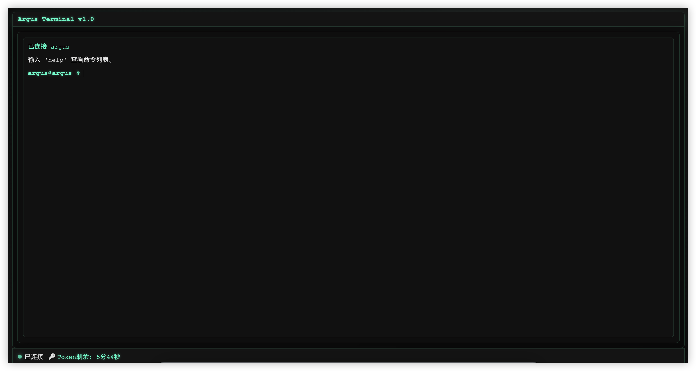
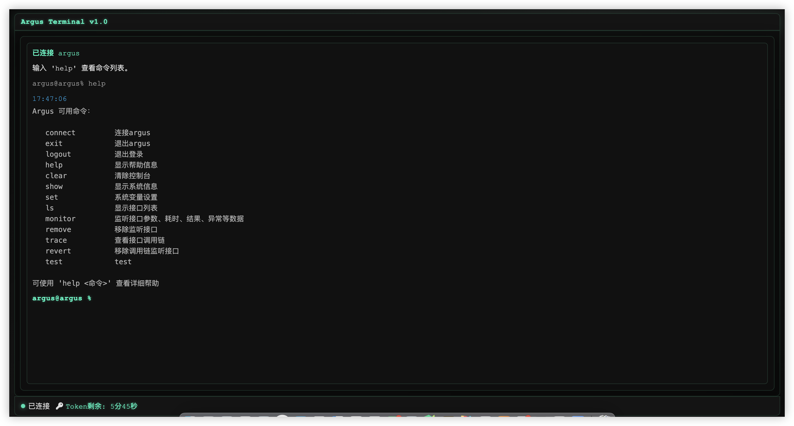
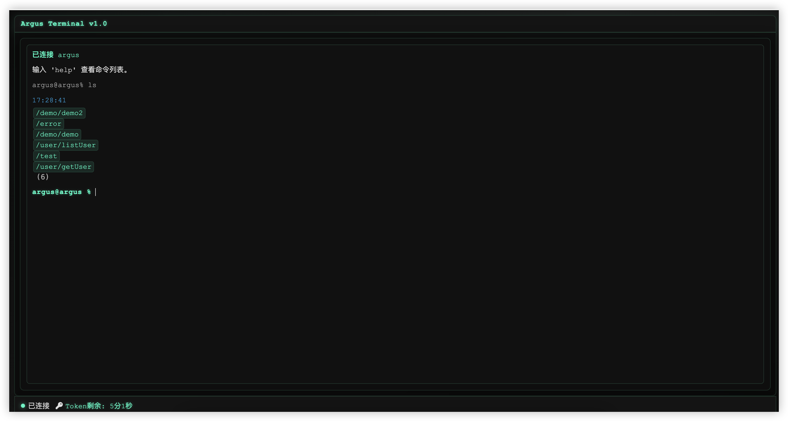
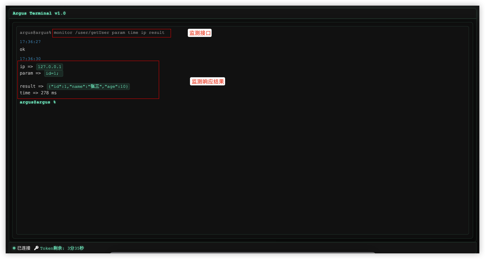
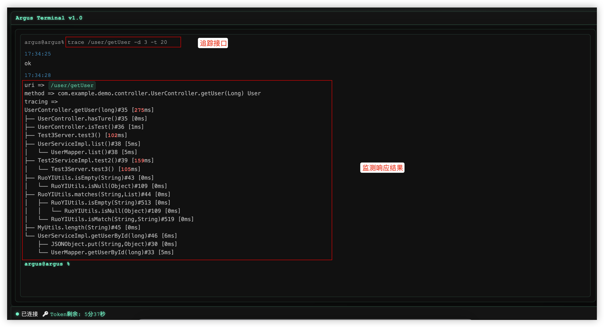

# ArgusLog 介绍

ArgusLog 是一款基于 SpringBoot 与 WebSocket 技术构建的轻量级接口监测与诊断工具，专为 Web 端命令行环境设计。其主要特点包括：\
1.全方位接口监测：支持对单接口或批量接口进行监测，全面覆盖请求参数、返回结果、响应耗时、异常信息及调用链追踪等关键维度。\
2.深度运行时诊断：集成多项高级诊断功能，包括：\
(1).Spring 容器 Bean 检索：支持动态查询、验证容器中 Bean 的定义、依赖关系及属性配置，快速定位依赖注入或配置加载异常。\
(2).Jad 字节码反编译：可实时查看部署环境中任意类的反编译源码，辅助分析第三方库行为、动态代理逻辑或线上源码不一致问题。\
(3).Sql 语句拦截：支持对 SQL 语句进行拦截，可实时查看、分析 SQL 语句执行情况。\
(4).Redis 缓存命令：支持Redis 命令执行。\
(5).Mq 监听命令：支持对 MQ消息监听。\
(6).方法检索与调用：支持对类和方法进行检索，并可以调用指定方法。\
(7).受限热部署：支持在不重启服务的情况下动态更新特定方法逻辑或配置类，提升开发调试与线上应急处理效率。\
3.高可扩展性与集成能力：支持用户自定义命令以适配不同项目需求，并能与企业现有用户体系无缝对接。\
4.安全与合规保障：通过自定义 Token 与有效期管理机制，确保操作安全性与审计合规性。\
# 功能介绍

## 1.接口监控

* 可使用 _**monitor [参数]**_ 命令 监听指定接口参数
* 可使用 _**remove [参数]**_ 命令移除监听的接口
* 可使用 _**ls -m**_ 命令查看当前监听的接口列表


可监控的接口参数：

**_param_**: 前端参数\
**_methodParam_**: 后端方法参数\
**_result_**: 接口返回结果\
**_time_**: 接口耗时\
**_header_**: 请求头\
**_ip_**: 请求ip\
**_url_**: 请求url\
**_api_**: 接口路径\
**_type_**: 方法全限定名\
**_method_**: 请求方式

## 2.接口追踪

* 可使用 _**trace [参数]**_ 命令 追踪指定接口调用链
* 可使用 _**revert [参数]**_ 命令移除追踪的接口
* 可使用 _**trace -m**_ 命令查看当前追踪的接口列表

trace追踪可指定参数:

_**-i**_    [过滤包名] \
**_-e_**    [排除包名] \
**_-d_**    [指定追踪深度] \
**_-t_**    [指定方法耗时颜色阈值]

## 3.spring ioc容器bean检索

可使用 **_ioc_** list [参数] 检索容器中的bean\
可使用 _**ioc**_ get [参数] 获取指定bean或类型的bean

## 4.反编译与热部署

可使用 _**jad**_ [**全限定性类名**]  [**方法列表**] 反编译字节码

**_jad_** 反编译可指定参数：

_**-p**_   [查看代理对象字节码] \
-_**om**_  [仅查看方法名（不显示方法体）]

## 5. sql拦截与查看
可使用 sql -p [包名] -c []

## 6. mq监听
可使用 mq monitor [队列] 监听拦截消费者，实现消息监听

# 快速使用：

## 1.引入依赖：

最新版本地址：
[Maven中央仓库地址(Sonatype Central)](https://central.sonatype.com/artifact/io.github.githubcew/arguslog)

```xml
      <dependency>
            <groupId>io.github.githubcew</groupId>
            <artifactId>arguslog</artifactId>
            <version>${version}</version> <!-- 换为实际版本号 -->
        </dependency>
```

## 2.配置argus权限：

需要放开的argus访问路径权限如下：
* /argus/**
* argus-ws


**不同认证框架配置参考下面进行配置**

### （1）Shiro 配置

```java
@Configuration
public class ShiroConfig {

   @Bean
   public ShiroFilterFactoryBean shiroFilter(SecurityManager securityManager) {

      ShiroFilterFactoryBean factoryBean = new ShiroFilterFactoryBean();
      factoryBean.setSecurityManager(securityManager);
      Map<String, String> filters = new LinkedHashMap<>();

      // 在此处配置放开 argus 权限
      filters.put("/argus/**", "anno");
      filters.put("/argus-ws", "anno");

      factoryBean.setFilterChainDefinitionMap(filters);
      return factoryBean;
   }
}
```


### （2）SpringSecurity 配置
```java
@Configuration
@EnableWebSecurity
public class SecurityConfig extends WebSecurityConfigurerAdapter {
    
    @Override
    protected void configure(HttpSecurity http) throws Exception {
        http
            .authorizeRequests()
                // 在此处配置放开 argus 权限
                .antMatchers("/argus/*","/argus-ws").permitAll()
             // 其他接口需要认证
            .anyRequest().authenticated()
            .and()
            .formLogin().disable()
            .httpBasic().disable()
            .csrf().disable(); 
    }
}
```

### （3）自定义Filter

只用在自定义的Filter逻辑中放开权限即可
```java
@WebFilter(urlPatterns = {"/*"}, filterName = "AuthTokenFilter")
public class AuthTokenFilter implements Filter {
    
    // 放开权限的路径
    private final String[] excludeUrlPatterns = new String[]{
     
           "/argus/**",
           "/argus-ws"
    };
    
   @Override
   public void doFilter(ServletRequest request, ServletResponse response, FilterChain chain) throws IOException, ServletException {
      HttpServletRequest httpRequest = (HttpServletRequest) request;
      HttpServletResponse httpServletResponse = (HttpServletResponse) response;
      String requestURI = httpRequest.getRequestURI();

      boolean matched = RegexHelper.isMatch(requestURI, excludeUrlPatterns);
      // 指定权限放行
      if (matched) {
         chain.doFilter(request, response);
      }
   }
}
```

## 3.启动项目

## 4.访问 argus

### 首页：
 
访问地址：http://ip:port/context/argus/index.html

_**ip**_：你的项目ip 

_**port**_: 你的项目端口


_**_context_**_: 你的项目上下文context


默认账户：
* 用户名: argus
* 密码: argus


## 5.使用argus

### （1）登录argus
登录argus成功后，会进入到argus web终端
]

### （2）查看可用命令
可使用help查看命令和命令的使用方法
]

### （3）查询接口列表

使用ls命令查看项目的接口列表
]


### （4）监控接口参数

使用命令monitor 监测接口参数
]


### （5）追踪接口调用链

使用命令trace 追踪接口调用链
]


# 系统配置

## 默认配置

```yaml

## 认证配置
argus.enable-auth=true #是否开启登录认证

## 账户配置
argus.username=argus  # 账户名
argus.password=argus  # 密码

## token配置
argus.token-flush-time= 60 #token刷新时间(秒)
argus.token-expire-time= 3600 #token过期时间（秒）

# argus信息配置
argus.print-banner=true #启动时打印argus banner
argus.print-user-info=true #启动时打印用户信息

## 线程池配置
argus.thread-core-num=1 #线程池核心线程数
argus.thread-num=3 #线程池最大线程数
argus.max-wait-queue-size=20 #最大任务队列数

## trace 相关默认配置
argus.trace-max-depth=6 #追踪最大深度
argus.trace-color-threshold=300 #追踪方法耗时颜色阈值
argus.trace-default-exclude-packages= sun.,java.,javax. #默认排查包
argus.trace-include-packages=null # 追踪包含的包
argus.trace-max-enhanced-class-num=500 # 最大增强类数量
argus.trace-exclude-packages=null # 追踪排除的包
argus.trace-max-thread-num=5 # 调用链处理线程数


```

其中部分配置可以在运行时使用命令 _**show**_ 查看, 命令 _**set**_ 修改，具体参考命令介绍部分。


# 命令介绍

## help

查看系统可用命令，也可以用help [命令] 或者  [命令] -h查看命令具体用法：
```shell
argus@argus% help
Argus 可用命令：

   connect         连接argus
   exit            退出argus
   logout          退出登录
   help            显示帮助信息
   clear           清除控制台
   show            显示系统信息
   set             系统变量设置
   ls              显示接口列表
   monitor         监听接口参数、耗时、结果、异常等数据
   remove          移除监听接口
   trace           查看接口调用链
   revert          移除调用链监听接口

可使用 'help <命令>' 查看详细帮助
```


查看命令用法
```shell
argus@argus% help monitor
Usage: monitor [-ahtV] [path] [targets...]
监听接口参数、耗时、结果、异常等数据
      [path]         接口路径
      [targets...]   监听接口目标参数， 可选：param,methodParam,result,time,
                       header,ip,url,api,type,method
  -a, --all          监听全部接口
  -h, --help         Show this help message and exit.
  -t, --total        不传参数时, 监听全部target, 多个参数用空格隔开
  -V, --version      Print version information and exit.
```
## connect

连接argus

```shell
argus@argus% ls
未连接，请先使用 connect 连接
argus@argus% connect
已连接 argus
输入 'help' 查看命令列表。
argus@argus %
```

## exit
关闭argus连接(不退出登录)

```shell
argus@argus% exit
已断开 argus 连接: 1000 
argus@argus %
```

## logout
退出登录
```shell
argus@argus% logout
```

指定后会延时跳转到登录页面

## clear
清除控制台

```shell
argus@argus% clear
```

## show
查看系统信息

目前可用变量为： config

_**用法**_：
```shell
Usage: show [-hV] [variable]
显示系统信息
      [variable]   变量名
  -h, --help       Show this help message and exit.
  -V, --version    Print version information and exit.
argus@argus %
```


_**示例**_：
1. 查看系统变量
```shell
argus@argus% show config
属性                           值                             可修改         描述                        
─────────────────────────────────────────────────────────────────────────────────────────────────
enableAuth                    true                           yes          认证状态                      
tokenFlushTime                60                             no           token 刷新时间（秒）             
printUserInfo                 true                           no           启动时打印用户信息                 
printBanner                   true                           no           启动时打印banner信息             
tokenExpireTime               3600                           no           token过期时间(秒)              
threadCoreNum                 1                              no           任务核心线程数                   
threadNum                     3                              no           任务非核心线程数                  
maxWaitQueueSize              20                             no           任务队列最大等待数量                
traceMaxEnhancedClassNum      1000                           yes          最大增强类数量                   
traceIncludePackages          [com.]                         yes          包含包                       
traceExcludePackages          []                             yes          排除包                       
traceDefaultExcludePackages   []                             no           默认排除包                     
traceMaxDepth                 6                              yes          调用链最大深度                   
traceColorThreshold           300                            yes          调用链方法耗时阈值(ms)
traceMaxThreadNum             5                              yes          调用链处理线程数

argus@argus %
```
部分变量可使用 _**set**_ 命令修改

## set

修改系统变量

_**用法**_：
```shell
Usage: set [-hV] variable values...
系统变量设置
      variable    系统变量名
      values...   值
  -h, --help      Show this help message and exit.
  -V, --version   Print version information and exit.
argus@argus %
```

_**示例**_：：

1.修改接口追踪最大深度
```shell
argus@argus% set traceMaxDepth 5 
ok
argus@argus %
```

2.关闭登录认证
```shell
argus@argus% set  enableAuth false 
ok
argus@argus %
```

## ls
**显示系统接口列表**

_**用法**_：

```shell
Usage: ls [-hmV] [path]
显示接口列表
      [path]      接口路径
  -h, --help      Show this help message and exit.
  -m              查看用户监听的接口,不传时查询全部接口
  -V, --version   Print version information and exit.
```

_**示例**_：

1.查询接口列表
```shell
argus@argus% ls
/demo/demo2
/error
/demo/demo
/user/listUser
/test
/user/getUser
 (6)  # 接口数量
argus@argus %
```
2.使用 * 模糊匹配查询
```shell
argus@argus% ls *demo*
/demo/demo2
/demo/demo
 (2)
argus@argus %
```
3.使用 ls -m 查询已检听的接口列表（也支持 * 模糊匹配）
```shell
rgus@argus% ls -m
/user/getUser
 (1)
argus@argus %
```

## monitor
**监听接口参数**

_**用法**_：
```shell
Usage: monitor [-ahtV] [path] [targets...]
监听接口参数、耗时、结果、异常等数据
      [path]         接口路径
      [targets...]   监听接口目标参数， 可选：param,methodParam,result,time,
                       header,ip,url,api,type,method
  -a, --all          监听全部接口
  -h, --help         Show this help message and exit.
  -t, --total        不传参数时, 监听全部target, 多个参数用空格隔开
  -V, --version      Print version information and exit.
argus@argus %
```

**可用target**：

**_param_**: 前端参数\
**_methodParam_**: 后端方法参数\
**_result_**: 接口返回结果\
**_time_**: 接口耗时\
**_header_**: 请求头\
**_ip_**: 请求ip\
**_url_**: 请求url\
**_api_**: 接口路径\
**_type_**: 方法全限定名\
**_method_**: 请求方式

_**示例**_：

1.监听接口(不指定target时，默认为: url,param,result,time)
```shell
monitor /user/getUser
ok
argus@argus %
```

2.监听接口(指定target)
```shell
monitor /user/getUser param result time
ok
argus@argus %
```

3.监听全部接口
```shell
monitor -a
ok
argus@argus %
```

4.监听全部接口,全部target
```shell
monitor -a -t
ok
argus@argus %
```

5.监听全部接口,指定target
```shell
monitor -a -t param result time
ok
argus@argus %
```

## remove

移除监听接口

_**用法**_：
```shell
Usage: remove [-ahV] [path]
移除监听接口
      [path]      接口路径
  -a, --all       移除所有接口
  -h, --help      Show this help message and exit.
  -V, --version   Print version information and exit.
argus@argus %
```

_**示例**_：

1.移除监听接口
```shell
argus@argus% remove /user/getUser
ok
argus@argus %
```

2.移除全部监听接口
```shell
argus@argus% remove -a
ok
argus@argus %
```


## trace

追踪接口调用链

_**用法**_：
```shell

Usage: trace [-hmV] [-d=] [-t=] [-e[=package...]]... [-i
             [=package...]]... [path]
查看接口调用链
      [path]               接口路径
  -d, --depth=   调用链的最大的深度
  -e, --exclude[=package...]
                           排除包名，过滤掉指定包名的方法
  -h, --help               Show this help message and exit.
  -i, --include[=package...]
                           指定包名，只显示包含指定包名的方法
  -m                       查看已监听的调用链接口
  -t, --threshold=
                           指定调用链方法耗时阈值，单位ms
  -V, --version            Print version information and exit.
argus@argus %
```

_**示例**_：

1.追踪接口
```shell
argus@argus% trace /user/getUser
ok
argus@argus %
```

2.追踪接口(指定包、深度、方法耗时颜色阈值)
```shell
argus@argus% trace /user/getUser -i com. -t 20 -d 5
ok
argus@argus %
```

3.查看已追踪的接口列表
```shell
argus@argus% trace -m
/user/getUser
 (1)
argus@argus %
```

## revert
取消追踪

_**用法**_：
```shell

Usage: revert [-ahV] [path]
移除调用链监听接口
      [path]      接口路径
  -a              移除监听的全部调用链接口
  -h, --help      Show this help message and exit.
  -V, --version   Print version information and exit.
argus@argus %
```

_**示例**_：

1.取消追踪接口
```shell
argus@argus% revert /user/getUser
ok
argus@argus %
```

2.取消全部追踪接口
```shell
argus@argus% revert -a
ok
argus@argus %
```

## ioc
spring ioc bean检索

_**用法**_：

```shell
Usage: ioc [-hV] operatorType [name]
spring ioc命令
      operatorType   spring ioc容器查询类型, list: 模糊查询(支持*匹配 bean名称 和
                       类名称) get: 精确查询(支持按 bean名称 和 bean类型)
      [name]         对象bean名称或者全限定类
  -h, --help         Show this help message and exit.
  -V, --version      Print version information and exit.
argus@chenenwei %
```

_**示例**_：

1.查询com.example下的全部bean
```shell
argus@chenenwei% ioc list *com.example*
auth => com.example.demo.config.Auth
demoApplication => com.example.demo.DemoApplication$$EnhancerBySpringCGLIB$$1
demoConfig => com.example.demo.config.DemoConfig$$EnhancerBySpringCGLIB$$1
myCommand => com.example.demo.config.MyCommand
scheduleConfig => com.example.demo.config.ScheduleConfig$$EnhancerBySpringCGLIB$$1
test2ServiceImpl => com.example.demo.service.Test2ServiceImpl
testApi => com.example.demo.controller.TestApi$$EnhancerBySpringCGLIB$$1
testController => com.example.demo.controller.TestController$$EnhancerBySpringCGLIB$$1
testRunner => com.example.demo.runner.TestRunner
testServer => com.example.demo.service.TestServer
testServiceImpl => com.example.demo.service.TestServiceImpl
testTask => com.example.demo.task.TestTask
userController => com.example.demo.controller.UserController$$EnhancerBySpringCGLIB$$1
userMapper => com.example.demo.mapper.UserMapper
userServiceImpl => com.example.demo.service.impl.UserServiceImpl$$EnhancerBySpringCGLIB$$1
xssFilter => com.example.demo.config.XssFilter
 (16)
argus@chenenwei %
```

2.查询全部实现过滤器Filter接口的bean
```shell
argus@chenenwei% ioc get javax.servlet.Filter
xssFilter => com.example.demo.config.XssFilter (order: -2147483648)
characterEncodingFilter => org.springframework.boot.web.servlet.filter.OrderedCharacterEncodingFilter (order: -2147483648)
requestBodyCacheFilter => githubcew.arguslog.web.filter.RequestBodyCachingFilter (order: -2147483647)
argusTraceRequestFilter => githubcew.arguslog.web.filter.ArgusTraceRequestFilter (order: -2147483638)
argusFilter => githubcew.arguslog.web.filter.ArgusFilter (order: -2147483628)
formContentFilter => org.springframework.boot.web.servlet.filter.OrderedFormContentFilter (order: -9900)
requestContextFilter => org.springframework.boot.web.servlet.filter.OrderedRequestContextFilter (order: -105)
 (7)
argus@chenenwei %
```

3.根据bean名称查询bean
```shell
argus@chenenwei% ioc get xssFilter
xssFilter => com.example.demo.config.XssFilter (order: -2147483648)
argus@chenenwei %
```

## jad
java反编译

_**用法**_：
```shell
Usage: jad [-hpV] [-om] className [methodNames...]
反编译指定类
      className            类全限定名
      [methodNames...]     方法名列表
  -h, --help               Show this help message and exit.
      -om, --only-method   只显示方法声明
  -p, --proxy              显示代理对象字节码
  -V, --version            Print version information and exit.
argus@chenenwei %
```

_**示例**_：

1.反编译指定的类（目标对象）
```java
argus@chenenwei% jad com.example.demo.config.Auth
package com.example.demo.config;

import githubcew.arguslog.core.account.Account;
import githubcew.arguslog.web.auth.ArgusAccountAuthenticator;
import org.springframework.stereotype.Component;

@Component
public class Auth
extends ArgusAccountAuthenticator {
    public Auth() {
        super();
    }

    @Override
    // line 21
    protected boolean customize(String username, String password, Account account) {
        return username.equals(account.getUsername()) && password.equals(account.getPassword());
    }
}

argus@chenenwei %
```

2.反编译指定的类（代理对象）
```java
argus@chenenwei% jad com.example.demo.config.DemoConfig$$EnhancerBySpringCGLIB$$1 -p
package com.example.demo.config;

import com.example.demo.config.DemoConfig;
import java.lang.reflect.Method;
import org.springframework.beans.BeansException;
import org.springframework.beans.factory.BeanFactory;
import org.springframework.cglib.core.ReflectUtils;
import org.springframework.cglib.core.Signature;
import org.springframework.cglib.proxy.Callback;
import org.springframework.cglib.proxy.MethodInterceptor;
import org.springframework.cglib.proxy.MethodProxy;
import org.springframework.cglib.proxy.NoOp;
import org.springframework.context.annotation.ConfigurationClassEnhancer;

/*
 * Exception performing whole class analysis ignored.
 */
public class DemoConfig$$EnhancerBySpringCGLIB$$1
extends DemoConfig
implements ConfigurationClassEnhancer.EnhancedConfiguration {
    private boolean CGLIB$BOUND;
    public static Object CGLIB$FACTORY_DATA;
    private static final ThreadLocal CGLIB$THREAD_CALLBACKS;
    private static final Callback[] CGLIB$STATIC_CALLBACKS;
    private MethodInterceptor CGLIB$CALLBACK_0;
    private MethodInterceptor CGLIB$CALLBACK_1;
    private NoOp CGLIB$CALLBACK_2;
    private static Object CGLIB$CALLBACK_FILTER;
    private static final Method CGLIB$setBeanFactory$6$Method;
    private static final MethodProxy CGLIB$setBeanFactory$6$Proxy;
    private static final Object[] CGLIB$emptyArgs;
    public BeanFactory $$beanFactory;

    static void CGLIB$STATICHOOK3() {
        CGLIB$THREAD_CALLBACKS = new ThreadLocal();
        CGLIB$emptyArgs = new Object[0];
        Class<?> clazz = Class.forName("com.example.demo.config.DemoConfig$$EnhancerBySpringCGLIB$$1");
        Class<?> clazz2 = Class.forName("org.springframework.beans.factory.BeanFactoryAware");
        CGLIB$setBeanFactory$6$Method = ReflectUtils.findMethods(new String[]{"setBeanFactory", "(Lorg/springframework/beans/factory/BeanFactory;)V"}, clazz2.getDeclaredMethods())[0];
        CGLIB$setBeanFactory$6$Proxy = MethodProxy.create(clazz2, clazz, "(Lorg/springframework/beans/factory/BeanFactory;)V", "setBeanFactory", "CGLIB$setBeanFactory$6");
    }

    final void CGLIB$setBeanFactory$6(BeanFactory beanFactory) throws BeansException {
        super.setBeanFactory(beanFactory);
    }

    @Override
    public final void setBeanFactory(BeanFactory beanFactory) throws BeansException {
        MethodInterceptor methodInterceptor = this.CGLIB$CALLBACK_1;
        if (methodInterceptor == null) {
            DemoConfig$$EnhancerBySpringCGLIB$$1.CGLIB$BIND_CALLBACKS((Object)this);
            methodInterceptor = this.CGLIB$CALLBACK_1;
        }
        if (methodInterceptor != null) {
            Object object = methodInterceptor.intercept(this, CGLIB$setBeanFactory$6$Method, new Object[]{beanFactory}, CGLIB$setBeanFactory$6$Proxy);
            return;
        }
        super.setBeanFactory(beanFactory);
    }

    public static MethodProxy CGLIB$findMethodProxy(Signature signature) {
        String string = ((Object)signature).toString();
        switch (string.hashCode()) {
            case 2095635076: {
                if (!string.equals("setBeanFactory(Lorg/springframework/beans/factory/BeanFactory;)V")) break;
                return CGLIB$setBeanFactory$6$Proxy;
            }
        }
        return null;
    }

    public DemoConfig$$EnhancerBySpringCGLIB$$1() {
        DemoConfig$$EnhancerBySpringCGLIB$$1 demoConfig$$EnhancerBySpringCGLIB$$1 = this;
        super();
        DemoConfig$$EnhancerBySpringCGLIB$$1.CGLIB$BIND_CALLBACKS((Object)demoConfig$$EnhancerBySpringCGLIB$$1);
    }

    public static void CGLIB$SET_THREAD_CALLBACKS(Callback[] callbackArray) {
        CGLIB$THREAD_CALLBACKS.set(callbackArray);
    }

    public static void CGLIB$SET_STATIC_CALLBACKS(Callback[] callbackArray) {
        CGLIB$STATIC_CALLBACKS = callbackArray;
    }

    private static final void CGLIB$BIND_CALLBACKS(Object object) {
        block2: {
            Object object2;
            DemoConfig$$EnhancerBySpringCGLIB$$1 demoConfig$$EnhancerBySpringCGLIB$$1;
            block3: {
                demoConfig$$EnhancerBySpringCGLIB$$1 = (DemoConfig$$EnhancerBySpringCGLIB$$1)object;
                if (demoConfig$$EnhancerBySpringCGLIB$$1.CGLIB$BOUND) break block2;
                demoConfig$$EnhancerBySpringCGLIB$$1.CGLIB$BOUND = true;
                object2 = CGLIB$THREAD_CALLBACKS.get();
                if (object2 != null) break block3;
                object2 = CGLIB$STATIC_CALLBACKS;
                if (CGLIB$STATIC_CALLBACKS == null) break block2;
            }
            Callback[] callbackArray = (Callback[])object2;
            DemoConfig$$EnhancerBySpringCGLIB$$1 demoConfig$$EnhancerBySpringCGLIB$$12 = demoConfig$$EnhancerBySpringCGLIB$$1;
            demoConfig$$EnhancerBySpringCGLIB$$12.CGLIB$CALLBACK_2 = (NoOp)callbackArray[2];
            demoConfig$$EnhancerBySpringCGLIB$$12.CGLIB$CALLBACK_1 = (MethodInterceptor)callbackArray[1];
            demoConfig$$EnhancerBySpringCGLIB$$12.CGLIB$CALLBACK_0 = (MethodInterceptor)callbackArray[0];
        }
    }

    static {
        DemoConfig$$EnhancerBySpringCGLIB$$1.CGLIB$STATICHOOK4();
        DemoConfig$$EnhancerBySpringCGLIB$$1.CGLIB$STATICHOOK3();
    }

    static void CGLIB$STATICHOOK4() {
    }
}
argus@chenenwei %
```

3.反编译指定方法
```java
argus@chenenwei% jad com.example.demo.config.Auth customize
    
protected boolean customize(String username, String password, Account account) {
    return username.equals(account.getUsername()) && password.equals(account.getPassword());
}

argus@chenenwei %
```

4.反编译类（只查看方法）
```java
argus@chenenwei% jad com.example.demo.config.Auth -om
public Auth();
protected boolean customize(String username, String password, Account account);
argus@chenenwei %
```
# 自定义开发

## 自定义新命令

_**步骤：**_

* 定义命令：\
     1.继承 BaseCommand 类 \
     2.重写 execute() 方法 \
     3.自定义业务逻辑 \
     4.可使用picocliOutput.out输出正常数据，可使用picocliOutput.err输出错误数据（或直接抛出异常）\
     5.返回状态码（OK_CODE, ERROR_CODE）

```java
// 命令描述
@CommandLine.Command(
        name = "hello",
        description = "hello",
        mixinStandardHelpOptions = true
)

// 定义hello命令, 继承BaseCommand
public class HelloCmd extends BaseCommand {

    // 配置命令选项和参数
    @CommandLine.Parameters(
            index = "0",
            description = "命令输入",
            arity = "1",
            paramLabel = "text"
    )
    private String text;

    /**
     * 1.继承 BaseCommand 类
     * 2.重写 execute() 方法
     * 3.自定义逻辑
     * 4.可使用picocliOutput.out输出正常数据，可使用picocliOutput.err输出错误数据（或直接抛出异常）
     * 5.返回状态码（OK_CODE, ERROR_CODE）
     * @return 命令执行状态结果
     */
    @Override
    protected Integer execute() {
        // 自定义逻辑，输出内容到命令行
        picocliOutput.out(text);
        return OK_CODE;
    }
}
```

* 注册命令：
     1.实现 ArgusConfigurer 接口
     2.重写registerCommand方法并注册定义的命令


```java
@Component
public class MyCommand implements ArgusConfigurer {

    /**
     * 注册自定义命令
     * @param commandManager argus命令管理器
     */
    @Override
    public void registerCommand(CommandManager commandManager) {
        // 注册hello命令
        commandManager.register(HelloCmd.class);
    }
}
```


_**示例**_：

1.自定义hello命令

```java
/**
 *
 * 自定义命令和注册步骤：
 *
 * 定义命令：
 *      1.继承 BaseCommand 类
 *      2.重写 execute() 方法
 *      3.自定义逻辑
 *      4.可使用picocliOutput.out输出正常数据，可使用picocliOutput.err输出错误数据（或直接抛出异常）
 *      5.返回状态码（OK_CODE, ERROR_CODE）
 * 注册命令：
 *      1.实现 githubcew.arguslog.config.ArgusConfigurer 接口
 *      2.重写并注册定义的命令 
 *        @Override
 *        public void registerCommand(CommandManager commandManager) {
 *         // 命令
 *         commandManager.register("hello", HelloCmd.class);
 *        }
 */
@Component
public class MyCommand implements ArgusConfigurer {

    /**
     * 注册自定义命令
     * @param commandManager argus命令管理器
     */
    @Override
    public void registerCommand(CommandManager commandManager) {
        // 命令： key: 命令名称 value: 命令类
        commandManager.register("hello", HelloCmd.class);
    }

    // 命令描述
    @CommandLine.Command(
            name = "hello",
            description = "hello",
            mixinStandardHelpOptions = true
    )

    // 定义hello命令
    public static class HelloCmd extends BaseCommand {

        // 配置命令选项和参数
        @CommandLine.Parameters(
                index = "0",
                description = "命令输入",
                arity = "1",
                paramLabel = "text"
        )
        private String text;

        /**
         * 1.继承 BaseCommand 类
         * 2.重写 execute() 方法
         * 3.自定义逻辑
         * 4.可使用picocliOutput.out输出正常数据，可使用picocliOutput.err输出错误数据（或直接抛出异常）
         * 5.返回状态码（OK_CODE, ERROR_CODE）
         * @return 命令执行状态结果
         */
        @Override
        protected Integer execute() {
            // 自定逻辑
            picocliOutput.out(text);
            return OK_CODE;
        }
    }
}
```

_**自定义命令使用示例**_

查看hello命令用法
```shell
argus@argus% help hello
Usage: hello [-hV] text
hello
      text        命令输入
  -h, --help      Show this help message and exit.
  -V, --version   Print version information and exit.
argus@argus %
```

命令hello使用
```shell
argus@argus% hello argus
argus
argus@argus %

```

## 自定义认证 

1.toke认证 

与项目使用相同认证凭证，实现接口类 TokenProvider, 实现 provide() 方法,返回Token（凭证token，有效期时间）对象

_**示例**_：
 ```java
@Component
public class CustomTokenAuth implements TokenProvider {
    
    @Resource
    private SessionMapper sessionMapper;
    
    @Override
    public Token provide(String username) {
        Session session = sessionMapper.getSessionByUsername(username);
        if(session != null){
            return new Token(session.getTokenValue(),System.currentTimeMillis() + 60 * 60 * 1000);
        }
        return null;
    }
}
 ```


2.用户认证

使用自定义的用户密码认证方式，ArgusAccountAuthenticator 类提供了认证方法 customize(String username, String password, Account provide)
实现逻辑之后就可以使用系统的用户登录 argus

_**示例**_：：

```java

@Component
@Slf4j
public class CustomAuth extends ArgusAccountAuthenticator {

   @Autowired
   ISysUserService sysUserServices;

   @Override
   protected boolean customize(String username, String password, Account provide) {
      SysUser sysUser = sysUserServices.selectUserByLoginName(username);
      if (sysUser != null) {
         return sysUser.getPassword().equals(Md5Utils.hash(username + password));
      } else {
         log.error("用户不存在");
      }
      return false;
   }
}
```
