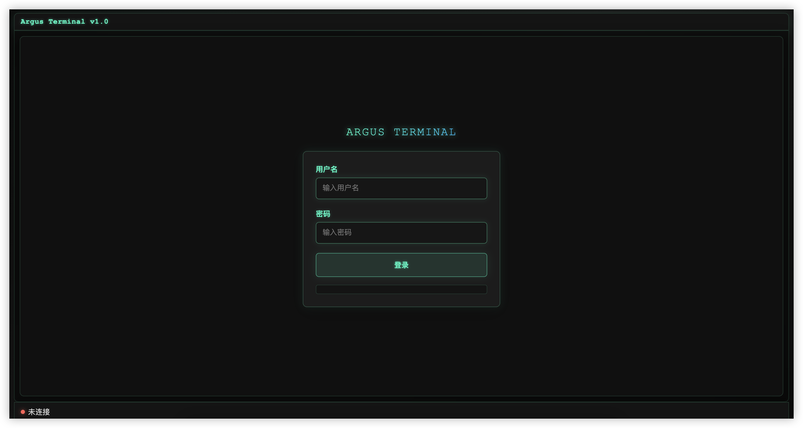

# ArgusLog 介绍

ArgusLog是一个基于SpringBoot + Websocket 开发的接口监测web端命令行工具, 主要用于开发或线上接口定位、性能优化分析，支持针对一个或多个接口的的入参、返回值、耗时、异常、调用链进行监测， 可以解决一些复杂场景下接口监测的问题。

# 快速使用：

## 1.引入依赖：

最新版本访问
[Maven中央仓库地址(Sonatype Central)](https://central.sonatype.com/artifact/io.github.githubcew/arguslog)

```xml
      <dependency>
            <groupId>io.github.githubcew</groupId>
            <artifactId>arguslog</artifactId>
            <version>${version}</version> <!-- 换为实际版本号 -->
        </dependency>
```

## 2.配置argus权限：

需要放开的argus访问路径权限如下：
* /argus/**
* argus-ws


**不同认证框架配置参考下面进行配置**

### （1）Shiro 配置

```java
@Configuration
public class ShiroConfig {

   @Bean
   public ShiroFilterFactoryBean shiroFilter(SecurityManager securityManager) {

      ShiroFilterFactoryBean factoryBean = new ShiroFilterFactoryBean();
      factoryBean.setSecurityManager(securityManager);
      Map<String, String> filters = new LinkedHashMap<>();

      // 在此处配置放开 argus 权限
      filters.put("/argus/**", "anno");
      filters.put("/argus-ws", "anno");

      factoryBean.setFilterChainDefinitionMap(filters);
      return factoryBean;
   }
}
```


### （2）SpringSecurity 配置
```java
@Configuration
@EnableWebSecurity
public class SecurityConfig extends WebSecurityConfigurerAdapter {
    
    @Override
    protected void configure(HttpSecurity http) throws Exception {
        http
            .authorizeRequests()
                // 在此处配置放开 argus 权限
                .antMatchers("/argus/*","/argus-ws").permitAll()
             // 其他接口需要认证
            .anyRequest().authenticated()
            .and()
            .formLogin().disable()
            .httpBasic().disable()
            .csrf().disable(); 
    }
}
```

### （3）自定义Filter

只用在自定义的Filter逻辑中放开权限即可
```java
@WebFilter(urlPatterns = {"/*"}, filterName = "AuthTokenFilter")
public class AuthTokenFilter implements Filter {
    
    // 放开权限的路径
    private final String[] excludeUrlPatterns = new String[]{
     
           "/argus/**",
           "/argus-ws"
    };
    
   @Override
   public void doFilter(ServletRequest request, ServletResponse response, FilterChain chain) throws IOException, ServletException {
      HttpServletRequest httpRequest = (HttpServletRequest) request;
      HttpServletResponse httpServletResponse = (HttpServletResponse) response;
      String requestURI = httpRequest.getRequestURI();

      boolean matched = RegexHelper.isMatch(requestURI, excludeUrlPatterns);
      // 放开权限直接放行
      if (matched) {
         chain.doFilter(request, response);
      }
   }
}
```

## 3.启动项目

## 4.访问 argus

### 首页：
 
访问地址：http://ip:port/context/argus/index.html

ip：你的项目ip 

port: 你的项目端口


context: 你的项目上下文context


默认账户：
* username: argus
* password: argus




## 5.使用argus

### （1）登录argus
登录argus成功后，会进入到argus web终端
]

### （2）查看可用命令
可使用help查看命令和命令的使用方法
]

### （3）查询接口列表

使用ls命令查看项目的接口列表
]


### （4）监控接口参数

使用命令monitor 监测接口参数
]


### （5）追踪接口调用链

使用命令trace 追踪接口调用链
]


## 自定义开发：
1. 克隆项目
```shell
git clone https://github.com/GitHubCew/ArgusLog.git
```

2. 使用maven clean install 命令安装到本地maven仓库
```shell
maven clean install
```
或者从Maven中央仓库拉取最新依赖：


3. 在项目中引用依赖:

```xml
      <dependency>
            <groupId>io.github.githubcew</groupId>
            <artifactId>arguslog</artifactId>
            <version>${version}</version> <!-- 换为实际版本号 -->
        </dependency>
```

4. 如果项目中有安全校验，则需要放开路径：
    - `/argus-ws`
    - `/argus/**`


例如：Shiro中添加：

   ```java
   filters.put("/argus-ws", "anon");
   filters.put("/argus/**", "anon");
   ```

SpringSecurity中添加：
```java
@Configuration
@EnableWebSecurity
public class SecurityConfig extends WebSecurityConfigurerAdapter {
    
    @Override
    protected void configure(HttpSecurity http) throws Exception {
        http
            .authorizeRequests()
                // 放开指定的接口
                .antMatchers("/argus-ws", "/argus/*").permitAll()
                // 其他接口需要认证
                .anyRequest().authenticated()
            .and()
            .formLogin().disable()
            .httpBasic().disable()
            .csrf().disable(); // 根据需求决定是否禁用CSRF
    }
}
```


5. 启动项目


6. 访问项目web + `/argus/index.html`  
   例如： `http://localhost:8080/context/argus/index.html` (context: 为项目的context-path上下文)


7. 进入arguslog,如果出现如下界面，则成功


8.命令介绍
-  connect         连接argus
-  exit            退出argus
-  logout          退出登录
-  help            显示帮助信息
-  clear           清除控制台
-  show            显示系统信息
-  set             系统变量设置
-  ls              显示接口列表
-  monitor         监听接口参数、耗时、结果、异常等数据
-  remove          移除监听接口
-  trace           查看接口调用链
-  revert          移除调用链监听接口

可使用 'help <命令>' 查看详细帮助

# 示例

存在如下接口：
```java
    @GetMapping("/activityWalkRouteActivity/info")
    public Result<ActivityWalkRouteActivityInfoVO> info(@RequestParam("id") Long id) {
        // TODO
    }
```

如果我们要监控 `/activityWalkRouteActivity/info` 的入参和耗时。
```shell
# minitor 监听全部命令参数
 monitor /activityWalkRouteActivity/info  -a
 
 # minitor 监听入参,耗时
  monitor /activityWalkRouteActivity/info  param time
```

2 结果输出
```shell 
# 接口监测结果输出
param ==> "id":495   # 方法参数
time  ==> 151 ms # 方法耗时

```

### show显示修改变量
```shell
argus@guest% show
属性                           值                             可修改         描述                        
─────────────────────────────────────────────────────────────────────────────────────────────────
enableAuth                    true                           yes          认证状态                      
tokenFlushTime                60                             no           token 刷新时间（秒）             
printUserInfo                 true                           no           启动时打印用户信息                 
printBanner                   true                           no           启动时打印banner信息             
tokenExpireTime               3600                           no           token过期时间(秒)              
threadCoreNum                 1                              no           任务核心线程数                   
threadNum                     3                              no           任务非核心线程数                  
maxWaitQueueSize              20                             no           任务队列最大等待数量                
traceMaxEnhancedClassNum      500                            yes          最大增强类数量                   
traceIncludePackages          null                           yes          包含包                       
traceExcludePackages          null                           yes          排除包                       
traceDefaultExcludePackages   [sun., javax., java.]          no           默认排除包                     
traceMaxDepth                 6                              yes          调用链最大深度                   
traceColorThreshold           300                            yes          调用链方法耗时阈值(ms)
argus@ %

```
使用set {key} {value} 修改变量值,可修改认证方式, trace调用链的 包含包,排除包以及调用阈值

## 扩展
### 自定义命令
1.继承BaseCommand类 创建自定义命令类,使用注解@CommandLine.Command 标记命令名称
重写命令执行方法  public Integer execute()
```
  @Override
    public Integer execute() throws Exception {
        // todo 业务逻辑
    }
```
2.注册自定义命令 使用 CommandManager 类的register进行注册
 ```
    commandManager.register("help", HelpCmd.class);
 ```

### 自定义认证 
1.toke认证 与项目使用相同认证凭证，实现接口类 TokenProvider, 实现 provide() 方法,返回Token（凭证token，有效期时间）对象
#### 示例
 ```java
@Component
public class CustTokenAuth implements TokenProvider {
    @Resource
    ShiroConfig shiroConfig;
    @Override
    public Token provide() {
        boolean authenticated = SecurityUtils.getSubject().isAuthenticated();
        if(authenticated){
            Object attribute = ShiroUtils.getSession().getAttribute(ShiroConstants.CSRF_TOKEN);
            return new Token(Convert.toStr(attribute),System.currentTimeMillis()+ 60*60*1000);
        }
        return null;
    }
}
    
 ```


2.用户认证, 使用自定义的用户密码认证方式   ArgusAccountAuthenticator 类提供了认证方法 customize(String username, String password, Account provide) 
#### 示例

```java

@Component
@Slf4j
public class CustAuth extends ArgusAccountAuthenticator {

   @Autowired
   ISysUserService sysUserServices;

   @Override
   protected boolean customize(String username, String password, Account provide) {
      SysUser sysUser = sysUserServices.selectUserByLoginName(username);
      if (sysUser != null) {
         return sysUser.getPassword().equals(Md5Utils.hash(username + password));
      } else {
         log.error("用户不存在");
      }
      return false;
   }
}
```
